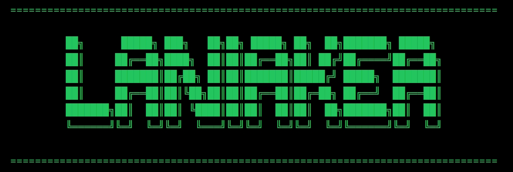

# Laniakea: Neural Blockchain Intelligence Network

[](https://x.com/Our_Laniakea)
[](https://github.com/OurLaniakea/Laniakea)

## Table of Contents
- [Overview](#overview)
- [Key Features](#key-features)
- [Technical Architecture](#technical-architecture)
- [Quick Start](#quick-start)
- [Documentation](#documentation)
- [Development Roadmap](#development-roadmap)
- [Security](#security)
- [Contact](#contact)

## Overview
Laniakea is a revolutionary distributed computing framework that combines advanced artificial intelligence with high-performance blockchain technology. Built on Solana's robust foundation, Laniakea achieves unprecedented processing capabilities of up to 75,000 TPS while incorporating sophisticated AI operations at the protocol level.

## Key Features
- **Quantum-Enhanced Processing**: Utilizes quantum-inspired algorithms for transaction processing
- **Neural Consensus Mechanism**: AI-driven consensus protocol for optimal network performance
- **Distributed Intelligence Matrix**: Decentralized AI computation across the network
- **Advanced Security Protocol**: Multi-layered security with quantum-resistant encryption
- **Dynamic Resource Allocation**: Smart resource management between AI and blockchain operations

## Technical Architecture
### Core Components
1. **Quantum Neural Interface (QNI)**
   - AI model integration
   - Quantum state management
   - Neural transaction processing
   - Real-time optimization

2. **Distributed Computing Engine (DCE)**
   - High-performance validator nodes
   - AI processing capabilities
   - GPU acceleration support
   - Dynamic load balancing

3. **Neural Transaction Pipeline**
   - AI-optimized transaction routing
   - Dynamic fee adjustment
   - Intelligent memory management
   - Parallel execution optimization

## Quick Start

### Prerequisites
- Rust 1.70.0 or higher
- CUDA 11.0+ (for GPU support)
- Solana CLI tools
- 64GB RAM minimum
- NVIDIA GPU with 8GB+ VRAM (recommended)

### Installation
```bash
# Clone the repository
git clone https://github.com/OurLaniakea/Laniakea.git

# Navigate to project directory
cd Laniakea

# Build the project
cargo build --release
```

### System Requirements
- Multi-core CPU (8+ cores recommended)
- High-speed SSD storage
- Stable internet connection
- CUDA-compatible GPU

## Documentation
Comprehensive documentation available in the `/docs` directory:
- [Architecture Overview](docs/architecture.md)
- [Development Guide](docs/development.md)
- [API Reference](docs/api-reference.md)

### API Endpoints
- Network Management: `POST /api/v1/network/initialize`
- Model Deployment: `POST /api/v1/models/deploy`
- Computation: `POST /api/v1/network/{network_id}/compute`
- Status Monitoring: `GET /api/v1/network/{network_id}/status`

## Development Roadmap
### Phase 1: Foundation
- Core infrastructure deployment
- Basic AI integration
- Initial testnet launch

### Phase 2: Enhancement
- Advanced AI capabilities
- Quantum processing integration
- Performance optimization

### Phase 3: Scaling
- Network expansion
- Enterprise features
- Governance implementation

## Security
- Quantum-resistant cryptography
- Multi-layer authentication
- Secure parameter updates
- Rate limiting and access control
- Regular security audits

## Contact
- Website: https://ourlaniakea.space
- Twitter: @Our_Laniakea
- GitHub: https://github.com/OurLaniakea/Laniakea

## License
Copyright © Laniakea Foundation
All rights reserved.
